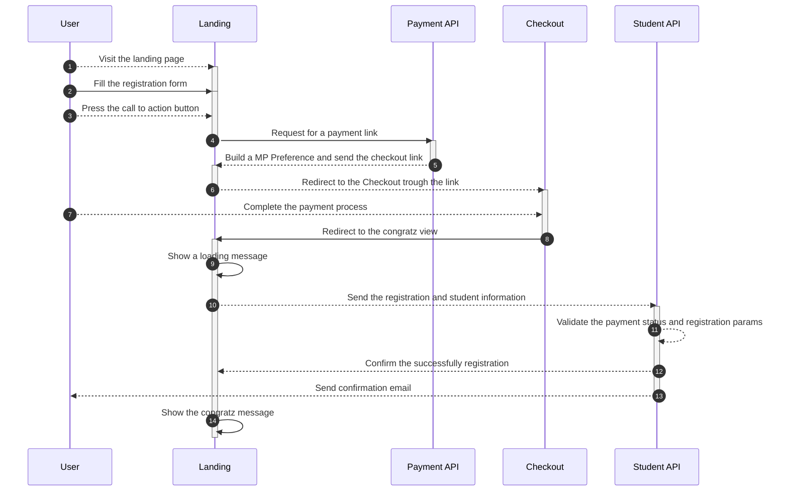

```mermaid
sequenceDiagram
autonumber
participant User
participant Landing
participant Payment API
participant Checkout
participant Student API
User -->> Landing : Visit the landing page
activate Landing
User ->> Landing : Fill the registration form
deactivate Landing
activate Landing
User -->> Landing : Press the call to action button
Landing ->> Payment API : Request for a payment link
deactivate Landing
activate Payment API
Payment API -->> Landing : Build a MP Preference and send the checkout link
deactivate Payment API
activate Landing
Landing -->> Checkout : Redirect to the Checkout trough the link
deactivate Landing
activate Checkout
User -->> Checkout : Complete the payment process
Checkout ->> Landing : Redirect to the congratz view
deactivate Checkout
activate Landing
Landing ->> Landing : Show a loading message
Landing -->> Student API : Send the registration and student information 
activate Student API
Student API -->> Student API : Validate the payment status and registration params
Student API -->> Landing : Confirm the successfully registration
Student API -->> User : Send confirmation email
deactivate Student API
Landing ->> Landing : Show the congratz message
deactivate Landing
```
